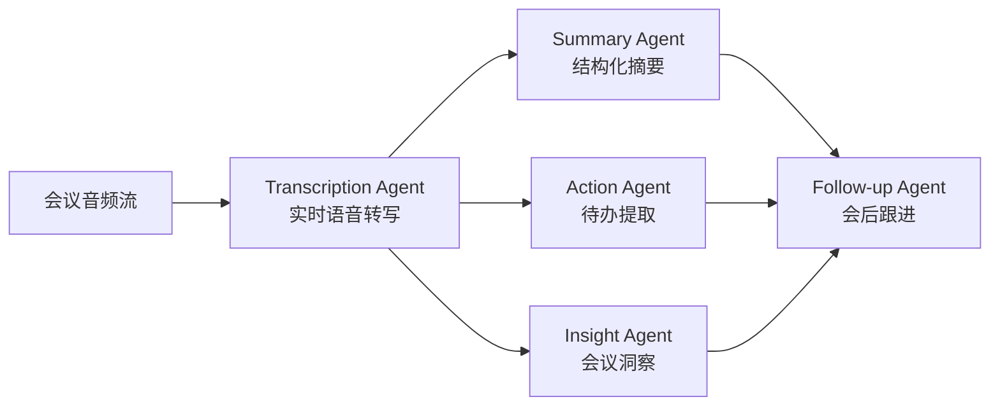

# 多Agent智能会议助手系统 - 项目规划

## 一、项目概述

构建企业级 5-Agent 智能会议助手系统，采用 **Pipeline + 并行（Fan-out / Fan-in）** 编排模式，基于 Python + LangGraph + FastAPI 实现。

## 二、系统架构



**编排模式**: Pipeline（音频→转写）+ 并行（摘要/待办/洞察同步执行）+ Fan-in 汇聚（跟进Agent）

## 三、技术栈

| 模块 | 技术选型 |
|------|----------|
| Agent 编排 | LangGraph（StateGraph + 并行） |
| 语音转写 | WhisperX + pyannote-audio（说话人识别） |
| LLM | MiniMax / OpenAI GPT-4o |
| Web 服务 | FastAPI + WebSocket |
| 外部集成 | Jira Cloud API + 飞书 Open API |
| 向量存储 | ChromaDB |
| 数据库 | PostgreSQL + asyncpg |
| 依赖管理 | uv（pyproject.toml） |
| 部署 | Docker + docker compose |

## 四、目录结构

```
.
├── src/
│   ├── agents/
│   │   ├── transcription_agent.py   # 转写 Agent（WhisperX）
│   │   ├── summary_agent.py         # 摘要 Agent（LLM）
│   │   ├── action_agent.py          # 待办 Agent（LLM + Jira/飞书）
│   │   ├── insight_agent.py         # 洞察 Agent（规则 + LLM）
│   │   └── followup_agent.py        # 跟进 Agent（汇聚 + 推送）
│   ├── graph/
│   │   └── meeting_graph.py         # LangGraph 编排核心
│   ├── integrations/
│   │   ├── minimax_client.py        # MiniMax LLM 客户端
│   │   ├── jira_client.py           # Jira Cloud 集成
│   │   └── feishu_client.py         # 飞书 Open API 集成
│   ├── models/
│   │   └── schemas.py               # 数据模型（dataclass）
│   ├── websocket/
│   │   └── server.py                # FastAPI + WebSocket 服务
│   └── main.py                      # 入口
├── docs/
│   ├── architecture.md              # 架构设计详解
│   └── api-reference.md             # API 参考文档
├── Dockerfile
├── docker-compose.yml
├── .dockerignore
├── .env.example                     # 环境变量模板
├── .gitignore
├── pyproject.toml                   # 依赖管理（uv）
├── uv.lock                          # 锁定文件
└── plan.md                          # 本文档
```

## 五、5个Agent核心实现

### 1. Transcription Agent（转写 Agent）
- **输入**: 音频流（WebSocket 二进制帧）
- **处理**: WhisperX 实时转写 + pyannote 说话人分离
- **输出**: `TranscriptResult`（含说话人标签、时间戳、置信度）
- **关键技术**: VAD 预处理降低幻觉、流式分块转写、说话人 embedding 缓存
- **降级**: 模型加载失败 → 使用内置演示转写数据

### 2. Summary Agent（摘要 Agent）
- **输入**: 完整转写文本
- **处理**: LLM 结构化提取（议题 / 讨论要点 / 结论 / 决策）
- **输出**: `MeetingSummary`（Markdown 格式会议纪要）
- **Prompt 设计**: Few-shot + JSON 结构化输出约束

### 3. Action Agent（待办 Agent）
- **输入**: 完整转写文本
- **处理**: LLM 提取行动项三元组（谁 / 做什么 / 截止时间）
- **输出**: `ActionResult`（含 Jira Issue Key 和飞书 Task ID）
- **集成**: 自动创建 Jira Issue + 飞书任务，幂等性保证

### 4. Insight Agent（洞察 Agent）
- **输入**: 转写文本 + `TranscriptResult`
- **处理**: 情感分析（LLM）+ 发言统计（规则引擎）+ 效率评分（综合算法）
- **输出**: `MeetingInsight`（情感 / 关键词 / 亮点 / 建议 / 效率分）

### 5. Follow-up Agent（跟进 Agent）
- **输入**: 摘要 + 待办 + 洞察（三个并行 Agent 的 Fan-in 汇聚）
- **处理**: 生成完整报告 + 推送飞书消息 + 设置提醒
- **输出**: `FollowUpResult`（飞书推送状态、Jira/飞书任务统计）

## 六、安全说明

- 所有 API Key / Token 通过 `.env` 文件注入，`.gitignore` 已排除
- 仅提供 `.env.example` 模板，不含真实密钥
- Docker 镜像通过 `.dockerignore` 排除 `.env` 文件，防止密钥打入镜像
